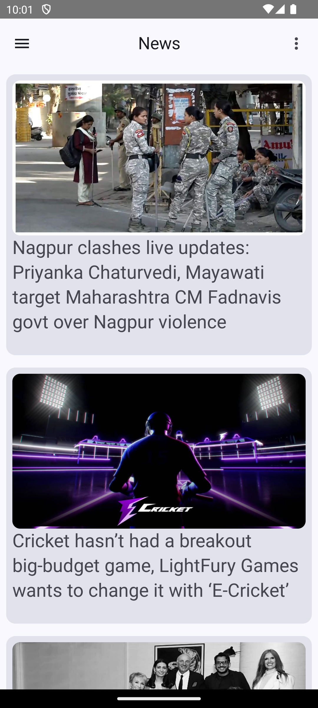
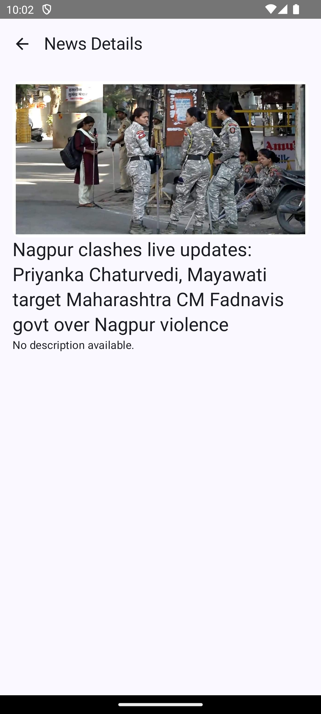

# GeekyNews App

GeekyNews is a modern Android application built with Jetpack Compose and MVVM architecture. It provides the latest news using Retrofit for API calls and Room for local storage. Dependency injection is managed with Hilt, and image loading is powered by Coil.

## Tech Stack

### 🛠️ Languages & Frameworks
- **Kotlin** - Primary language for Android development
- **Jetpack Compose** - Modern UI toolkit for building native UI

### 📦 Architecture & Libraries
#### **Android Jetpack**
- **Lifecycle** - Manage UI lifecycle states efficiently
- **ViewModel** - Store and manage UI-related data
- **LiveData** - Data holder class for lifecycle-aware components
- **Navigation Component** - Handles in-app navigation

#### **Dependency Injection**
- **Hilt** - Modern DI framework for Android

#### **Networking**
- **Retrofit** - For making API requests
- **Gson Converter** - JSON parsing

#### **Asynchronous Programming**
- **Coroutines & Flow** - Simplifies asynchronous operations

#### **Local Database**
- **Room** - Database persistence layer

#### **Image Loading**
- **Coil** - Fast and lightweight image loading library

### 🛠️ Build Configuration
- **Min SDK**: 21
- **Target SDK**: 34
- **Compile SDK**: 35
- **Build System**: Gradle Kotlin DSL

## 📦 Project Structure
```
├── app
│   ├── data (Handles API & Database)
│   ├── di (Hilt Dependency Injection)
│   ├── ui (Compose UI Screens)
│   ├── viewmodel (MVVM Architecture ViewModel)
│   ├── repository (Data Management)
│   ├── utils (Helper Functions)
│   ├── MainActivity.kt
│   └── NewsScreen.kt
│   └── NewsDetailScreen.kt
```

## 🚀 Getting Started
### Prerequisites
- Android Studio Flamingo or later
- Kotlin 1.8+

### Installation
1. Clone the repository:
   ```sh
   git clone https://github.com/geekysaif/GeekyNews.git
   ```
2. Open the project in **Android Studio**.
3. Sync Gradle dependencies.
4. Run the app on an emulator or a real device.

## 📌 Features
- 📑 Fetch latest news using **Retrofit**.
- 🗄️ Store articles offline using **Room DB**.
- 🎨 Modern UI with **Jetpack Compose**.
- 🔗 Seamless navigation with **Navigation Component**.
- ⚡ Fast and efficient with **Hilt Dependency Injection**.

## Screenshots 📸
### News List Screen, News Detail Screens

<table>
  <tr>
    <td></td>
    <td></td>
  </tr>
  <tr>
    <td align="center"><b> News List Screen</b></td>
    <td align="center"><b>News Detail Screen</b></td>
  </tr>
</table>

---
👨‍💻 Developed by [Mohd Saif Alam]

